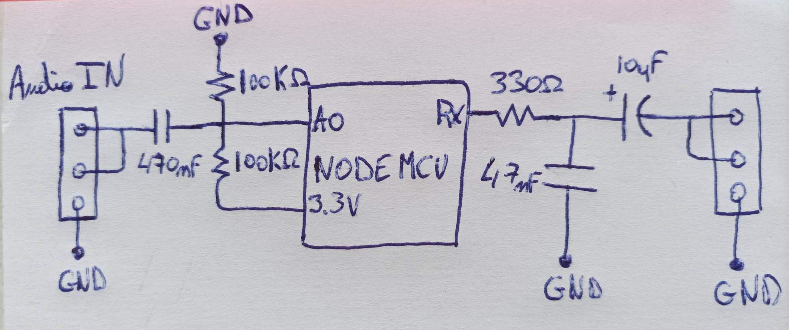

# ESP8266_Audio_In-Out

This code is write for ESP8266, it's tested on NodeMCU ESP-12E. 
Is take audio from ADC input (A0) and write it to I2S output (Rx). 
You need to switch your cpu frequency to 160Mhz (Arduino IDE : Tools -> CPU Freqency). 

I suggest to use this schema for circuit but it's works but it's upgradable :

Sources :
- 
- 
